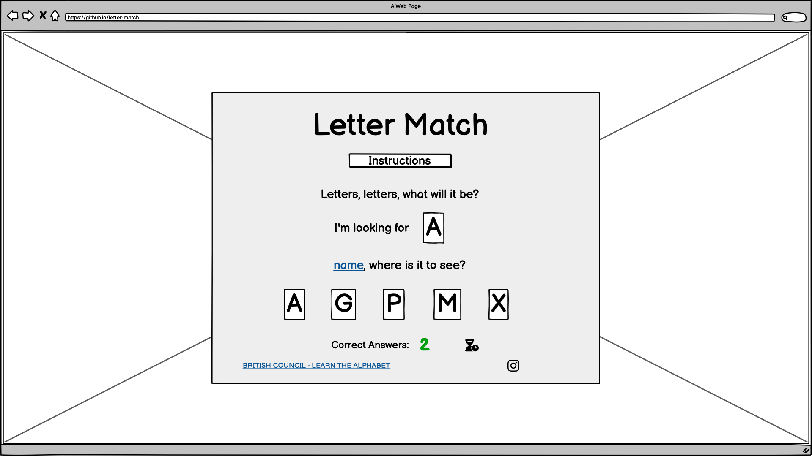
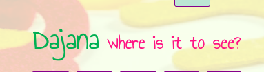

# Letter Match

_Javascript Essentials Project Portfolio - Code Institute_

View deployed site [here.](https://queenisabaer.github.io/letter-match/)

Letter Match is a game for kindergarten and preschool children. Its main goal is to help children to learn the alphabet and/or get to know the capital letters better. The game was inspired by an Instagram post by [create25printables](https://www.instagram.com/p/Cv2fjIxuwVR/?igshid=MTc4MmM1YmI2Ng%3D%3D&epik=dj0yJnU9XzBHMi1OY2sya2JpMS03RV9JVENYbWdhS0FzcldUOTgmcD0wJm49RGJFR2Q1d2Vxc0ZtLU1fdkJQa21SQSZ0PUFBQUFBR1djR0ZV). For older children it is a fun game to get as many points as possible within the given time. 

## Table of contents

- [User Experience (UX)](#user-experience)
- [Design](#design)
- [Features](#features)
- [Technologies Used](#technologies-used)
- [Testing](#testing)
- [Deployment](#deployment)
- [Credits](#credits)

## User Experience (UX)

### User stories

Goals for:

- **Children learning the alphabet: Preschool or Kindergarten**  
Children who are just learning the alphabet should be able to grasp the game and recognize the letter matches. Especially the start of the game should be accompanied by parents to explain the rules and possibly help with typing the name. As a future function, an audio file should be included, which reads the rules. If no name is entered and the start button was clicked directly, the game should still be running and a green placeholder name should be displayed. The start button should be easy to recognize.  The letters to look for should be easily recognizable. In order to grant a positive experience, points are not deducted and only points resulting from correct answers are counted. 

- **Children knowing the alphabet: Class 1 or higher**  
Children who already know the alphabet or can even read and write should also be able to easily understand the game and recognize the letter matches. Entering the name should be easy for you to understand. Correct answers are encouraged by congratulations, wrong answers give the opportunity to try again. Nevertheless, it is also about positive reinforcement, so no negative points are awarded in the game, if a wrong answer was clicked. Again, a positive gaming experience is in the foreground.

- **Older children or adults**  
Especially older children or adults are animated by the countdown to find as many matches as possible. The congratulatory text should therefore also adapt in certain steps, the higher the score is.  

## Design

- **Imagery:**
  The background image was discovered when searching for a letter image, it perfectly fits the theme that letters need to be searched. In addition, it was very colorful and perfect to generate the colors for the game. 
- **Colour Scheme:**
  The colors were determined with the pipette function of the website coloors. In general, the colors are very cheerful and colorful, as it is a game for children.  

  

  
 Color palette 

   

  
  

- **Typography:**
  [Annie use your teleskope](https://fonts.google.com/specimen/Annie+Use+Your+Telescope) was selected for text content. It's a cute font that is easy to read by children and yet has a certain lightness. 
  [Barlow Semi Condensed](https://fonts.google.com/specimen/Barlow+Semi+Condensed) is an easy-to-read, clear font that is simple to grasp, so it was used for the instructions. 
  The font [Are you serious](https://fonts.google.com/specimen/Are+You+Serious) was selected for the logo. It represents the fun and joy the game should bring. 
  > Are You Serious doesn't take itself seriously at all. This is a fun playful font with a very joyful spirit. _(Google Fonts)_

### Wireframes

 Welcome page before game starts 

 

 Instructions 

 

 Game 

 

 Correct answer 

 
Unfortunately, due to lack of time, I did not manage to set the background colors for the letter row correctly for wrong or correct answers. 

 Wrong answer 

 
During coding I decided to give the child another try to find the correct answer, so that he/she/they could improve his/her/their skill. Therefore, displaying the correct letter was no longer necessary. 

 Game ending 

 

## Features

### Existing Features

All the pages were created with a mobile first approach and are made responsive. To ensure that the layout of the pages remains consistent even on very large screens, the game body has been given a maximum width and a margin on both sides.  
In the game body, the logo is centered at the top. It works as a link to reset the game to the welcome screen.  
 
 

 Instructions 

 

The instructions modal opens and closes, when you click the instructions button. You can also close the modal with the escape key or by clicking on the x on the right corner. The button to open the modal stays above the game, allowing you to access it repeatedly during the game. 
 

 Name input 

 

In the welcome/start game panel or when you load the page, you will be asked for your name. If you enter a name with numbers in it, the game doesn't start and a warning is shown. I decided not to limit the use of special characters, so as not to exclude children with extraordinary names, like the children of Elon Musk. However, it is possible not to specify a name at all, then a placeholder (Abcedarian) is displayed as name. This is important for younger children who can not write their own name and who may start the game directly by pressing the enter key or clicking on the start game button. It is possible to submit the name input by clicking on the start game button or with the enter key. This will start the game as well. 
 
 
 

 Game 

 

The game itself consists of a short rhyme in which the child is asked to find the searched letter in a series of letters. The rhyme does not change during the game, only the letters are exchanged as soon as a correct answer is given. This is important for younger children to have a constant and focus on the letter cards. Within the pink rhyme, the entered name or placeholder appears in green. A different color for the name was chosen for the child to perceive directly. 
 
The letters to be matched rearrange themselves, after a correct answer was given so that it remains a challenge. In addition, a timer was set so that the game is limited. For a brief moment, a "GO!" is displayed in the timer to not lose a second of the 45 seconds and encourage the child. Only the correct answers are counted during the game to ensure a positive gaming experience for children.  
 
When the correct letter is clicked, a "Well done" message appears for a short moment and the letter in the rhyme turns green. Then the letter cards are mixed again.  
 
If the wrong letter has been clicked in the sequence, the "Sorry...try again" message appears for a short moment and the letter in the rhyme turns red. The letter cards are not reshuffled so the child has the opportunity to correct his mistake, gaining some more experience. 
 

 Restart game 

 

At the end of the timer, the restart game panel is displayed, which contains the last score and different congratulations depending on the score level. If the score is zero, you will be asked whether the letters have been clicked and the child is encouraged to try again.  
 
1. Congratulations text for a score up to 4 
 
2. Congratulations text for a score up to 9 
 
3. Congratulations text for a score up to 14 
 
4. Congratulations text for a score up to 19 
 
5. Congratulations text for a score up to 24 
 
6. Congratulations text for a score up or equal to 25 
 
Many different congratulatory texts were chosen to achieve a consistently positive reinforcement for the child. In addition, it can be rediscovered where there is a new text.  
The child then has the option to restart the game by clicking the start game button, the score is reset to zero and the timer starts again. However, the child’s name or placeholder will remain. 

 Footer 

 

The footer stays on the bottom of the game body and features clickable social media icons and a link to the british council - learn the alphabet website. All links on the footer are opened in a new tab. On tablets or larger screens,the text and the social media icons should appear in one row to create a picture that is more cohesive. 
 
 

### Features, which I would like to implement in the future

- I would like to create different levels of difficulty for the game. For example, that you can choose whether you want to match only uppercase letters or whether you compare between uppercase and lowercase letters. 
- I would like to allow a selection where you can set the time (e.g. 20/30/45/60 seconds).
- Add a highscore. 
- Adjust the background color of the lettercards in the letter row according to the correct or wrong answer.
- Add audio content to the instruction modal (Instructions to be read out loud - espacially for younger children). 

## Technologies Used

- [HTML5](https://en.wikipedia.org/wiki/HTML5)
- [CSS3](https://en.wikipedia.org/wiki/Cascading_Style_Sheets)
- [JavaScript](https://en.wikipedia.org/wiki/JavaScript) 
- [Google Fonts](https://fonts.google.com/) was used to import fonts into the style.css.
- [Font Awesome](https://fontawesome.com/) was used to add icons.
- [Git](https://git-scm.com/) was used for version control by utilizing the Gitpod terminal to commit to Git and Push to GitHub.
- [GitHub](https://github.com/) was used to save and store the files for the website.
- [Balsamiq](https://balsamiq.com/) was used to design the wireframes.
- [Coloors](https://coolors.co/image-picker) was used to create the color scheme.
- [iLoveIMG](https://www.iloveimg.com/) was used to cropp and resize the images.
- [Pixelied](https://pixelied.com/) was used to convert images from jpg to webp
- [imgtools](https://www.imgtools.co/) was used to resize webp images
- [CSS Gradient](https://cssgradient.io/) was used to create the gradient background of the instruction button
- [Am I Responsive](https://ui.dev/amiresponsive) was used to display the website on different devices.
- [beautifier](https://beautifier.io/) to beautify the code
- [Pexels](https://www.pexels.com/de-de/) was used to search and load the background image
- [Favicon.io](https://favicon.io/favicon-generator/) was used to create the favicon

## Testing

1. **Validator Testing**

- **[HTML Validator](https://validator.w3.org/)**

  - result for index.html 
  In the first attempt I was shown a warning regarding the section where my instruction modal is located.
     
   After changing this section into a div no more warnings or errors were detected.      
     
   
I also checked the page in the validator via text-input, and likewise no errors were detected in this way. All I got was an information to avoid trailing slashes in void elements.

- **[CSS Validator](https://jigsaw.w3.org/css-validator/)**
   - result for styles.css  
     
     The warning is due to import of the Google fonts.
- **[JSHint](https://jshint.com/)**
  - result for sript.js  
  On the first attempt there were some warnings about missing semicolons. After adding the missing semicolons to my javascript, no further warnings or errors were detected. 
    

2. **Lighthouse Test**  
   To measure the website against performance, accessibility, SEO and best practice I used [Lighthouse](https://chromewebstore.google.com/detail/lighthouse/blipmdconlkpinefehnmjammfjpmpbjk?hl=de). 
   - result for index.html 
   First, it gave a warning that the form element did not have the correct associated label. 
   
   After adjusting the label for the name input, I could increase the accessibility to 100.
    
   This is the result for desktop device:
   

3. **Manual testing**  
To ensure the pages are responsive, I used the Google Chrome developer tools.

| **Test** | **Test Description** | **Expected Outcome** | **Result**|
|:---|:---|:---|:---|
| Header - Logo | Click on the logo to return welcome/name panel | Clicking on the logo, even in the game, will return you to the main page | Pass |
| Footer - arrangement | Enlarge the view of the page to at least 768px to show the footer in one line | On tablets or bigger screen the footer should be presented in one line | Pass |
| Footer - British Council | Click on the British Council text and a new tab with the website opens | After clicking on the text for the british council, a new tab to the website of the British Council should open | Pass|
| Footer - Social Media icons | Click on the logo of Facebook or Instagram and a new tab with Facebook page or Instagram page opens | After clicking on the logo of Facebook it should open a new tab with the Facebook page, and after clicking on the Instagram logo, Instagram should open in a new tab as well | Pass |
| Start panel - name input | Name input field should be in focus | After the DOM is loaded the name input field should be in focus and ready to use(mouse pointer inside the field) | Pass |
| Start panel - name input | Enter a name with numbers | If a name is entered with a number, an error message should be displayed and the game should not start. | Pass |
| Start panel - name input | Enter a name with more than 15 characters | If a name with more than 15 letters is submitted, it will be canceled at the 15th letter. | Pass |
| Start panel - name input | Enter a valid name in the name input field and click the start game button or press the Enter key. | If a valid name was entered and the start game button is clicked or the Enter key is pressed, the game should start. | Pass |
| Start panel - name input | Don’t type a name in the name field or just use a space as name and click the start game button or press the Enter key. | If no name was entered or only spaces and the start game button is clicked or the Enter key is pressed, the game should start and in the name area of the game a placeholder("Abeccderian") should be visible. | Pass |
| Start panel - start game button | Click the start game button to start the game. | If the start game button is clicked, the game should start, the welcome panel should close and if the instructions modal was still open, it should be hidden again. | Pass |
| Game panel - letters | Start game or give a correct answer. | When the game starts or a correct answer was given, it should shuffle the letters. | Pass |
| Game panel - letters | Hover over the letters in the letter row with the mouse pointer. | When hovered over the letters in the letter row the background color of the letter should be yellow. | Pass |
| Game panel - name | Start or restart the game | When the game starts or restarts, the entered name or a placeholder should be appear inside the rhyme | Pass |
| Game panel - Correct answer | Start or restart the game | When the game starts or restarts, the score should be 0 | Pass |
| Game panel - Correct answer | In the row of letters, click on the letter corresponding to the rhyme | If you click on the letter corresponding to the rhyme in the row of letters, the score should increase, for a short momemnt a well done messsage should appear and the background of the letter in the letter row should be green | Pass |
| Game panel - Wrong answer | In the row of letters, click on a letter that is not corresponding to the rhyme | If you click on a letter that is not correspoding to the rhyme, for a short momemnt a "Sorry. Try again" messsage should appear and the background of the letter in the letter row should be red. | Pass |
| Game panel - Timer | Start or restart the game | When the game starts or restarts, for a brief moment the timer should say "GO!" and then start counting down to 0. | Pass |
| Game panel - Timer | Let the timer count down to zero. | When the countdown is down to zero, the game panel should close and open the restart game panel. | Pass |
| Restart game panel - Score | Let the timer count down to zero. | When the countdown is down to zero, the current score should be visible above the start game button. | Pass |
| Restart game panel - Score | Let the timer count down to zero. | When the countdown is down to zero, depending on the score a try again/congratulations message should be displayed. | Pass |
| Start/Restart game button | Hover over the start/restart game button with the mouse pointer. | When hovered over start/restart game button it should be pink. | Pass |

4. **Browser Compatibility** 
   The tests were conducted using the following browsers:

- Google Chrome Version 120.0.6099.129
- Safari on Mac Version 17.0 (17616.1.27.111.22, 17616)
- Safari on iOS 17.1.2
- Edge Version 120.0.2210.61

5. **Bugs**

- No bugs where found. 

## Deployment

This site is deployed using GitHub Pages. To deploy it from its GitHub repository to GitHub Pages, I took the following steps:
1. Log in (or sign up) to GitHub.
2. Navigate to the repository for this project by selecting [*queenisabaer/isbaner-vineyard*](https://github.com/queenisabaer/isbaner-vineyard)
3. Click the *Settings* tab above the repository 
4. In the left-hand menu, select *Pages*
5. In the section **"Build and deployment"** under *Source* select *Deploy from a branch* 
6. In the section **"Build and deployment"** under *Branch* select in the first area *main* and in the second *root*
7. Click the *Save* Button 
After refreshing the settings site for this repository above the **"Build and deployment"** section, you will see the GitHub Pages area with the link to the [view of the live site](https://queenisabaer.github.io/isbaner-vineyard/)

- Forking this GitHub repository
1.  Log in to GitHub.
2.  Navigate to the repository for this project by selecting [*queenisabaer/isbaner-vineyard*](https://github.com/queenisabaer/isbaner-vineyard)
3. Click at the top of the repository on the **Fork** button on the right side

- Clone this repository
1.  Log in to GitHub.
2.  Navigate to the repository for this project by selecting [*queenisabaer/isbaner-vineyard*](https://github.com/queenisabaer/isbaner-vineyard)
3. In the top right corner, click on the green *Code* button
4. Copy the HTTPS URL in the tab *Local*
5. Go to the code editor of your choice and open the terminal
5. Type `git clone` and paste the URL you copied into your terminal
6. Press the enter key

## Credits

### Content

- The background image is from Magda Ehlers and was found on the [Pexels](https://www.pexels.com/de-de/foto/kunst-muster-textur-abstrakt-4116706/) website.
- To write the various congratulation texts, I was inspired by the listing of [7ESL](https://7esl.com/well-done/)

### Code

- The instructions modal was created with the help of the tutorial by [Viktor Eke from freeCodeCamp](https://www.freecodecamp.org/news/how-to-build-a-modal-with-javascript/)
- To center the instructions modal I used an explanation from [Stack Overflow](https://stackoverflow.com/questions/8508275/how-to-center-a-position-absolute-element).
- To create the countdown I used the instruction by [James McDowell on Stack Overflow](https://stackoverflow.com/questions/31106189/create-a-simple-10-second-countdown)
- I found a great explanation for setting the restart button in the [Treehouse Community](https://teamtreehouse.com/community/any-one-know-how-to-make-a-restart-button)
- How to add and remove a class after a certain time, was found at [ITSourceCode.com](https://itsourcecode.com/javascript-tutorial/how-to-add-and-remove-class-after-5-seconds-in-javascript/).
- The functions to check whether the right or wrong letter is clicked have been inspired by [CodingNepal](https://www.codingnepalweb.com/build-memory-card-game-html-javascript/) among others. 
- To understand more about the concepts of JavaScript I used the udemy course: [The complete 2023 Web Development Bootcamp by Dr. Angela Yu](https://www.udemy.com/course/the-complete-web-development-bootcamp/)
- The following websites were used as a source of knowledge:  
  - [Google](www.google.com)
  - [mdn](https://developer.mozilla.org/en-US/)
  - [W3C](https://www.w3.org/)
  - [W3schools](https://www.w3schools.com/)
  - [DevDocs](https://devdocs.io/)
  - [Stack Overflow](https://stackoverflow.com/)
  - Slack Community

### Media

- Icons on the footer, the game and for links were taken from [Font Awesome](https://fontawesome.com/).
- The fonts were imported from [Google Fonts](https://fonts.google.com/).
- The favicon was created on [Favicon.io](https://favicon.io/favicon-generator/).

### ReadMe

- A big thank you to [Kera Cudmore](https://github.com/kera-cudmore) and all of her tips on what makes a good README.

### Acknowledgments

- I would like to thank my wonderful mentor Brian Macheria for his numerous tips and great assistance during the creation of this project. In particular, his guidance for the letter functions and the corresponding event listeners.
- Furthermore I would like to thank Niclas Hugdahl who helped me on Slack to get the right twist for my name input function and setting the checkAnswer/correctAnswer function. 

**This is for educational use.**